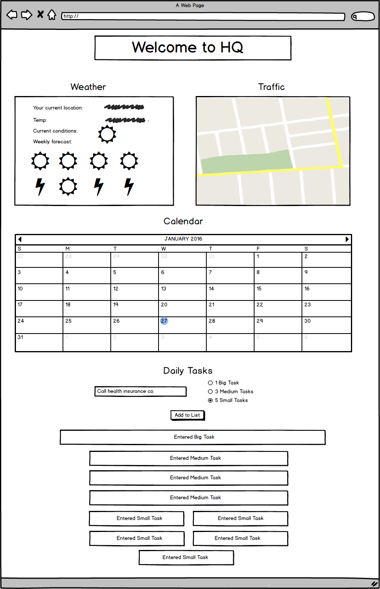

# Dave Sudia's Front-End Project Proposal

## Uses and Users
My project is a daily dashboard site to aid productivity. Its use is like the "Today" section of iOS' notification center. It displays local weather and traffic information, and the user's calendar and tasks. Users can visit the site to plan their day. They see information based on location and personal input. The site is useful to people who are at a computer most of the day who want quick access to relevant information.

## Technologies Involved
The site will make use of several languages and services. I will construct the main page using HTML and CSS, using Bootstrap to support the layout. The weather feature will use an IP-based geolocation API and the OpenWeather API. I will use Postman to help create the GET request. The traffic feature will use the Google Maps API with geolocation and a traffic layer added on. The calendar feature will use a Google authentication API. Finally, the to-do list will use jQuery for DOM manipulation.

## Features
### Local Weather

This feature will display:

- Current temperature

- Current weather conditions (Sunny, cloudy, etc)

  - Icon for conditions

- Five day forecast

The page will collect the user's latitude and longitude using an IP-based geolocation API. It will feed this data to the OpenWeather API, which will return a JSON object of the above data. The data will then display in a div. I will use a jQuery AJAX request to complete these calls.

### Local traffic

This feature displays a Google map with a traffic layer, centered on the user's current location. The Google map API requests permission to geolocate the user. It then centers the map there. I have this feature working already. The process required:

1. Creating a Google Developer account

2. Integrating their code into my pages

3. Resetting default center location and zoom level

### Personal Calendar

The page will display a user's calendar events for that day. This feature requires the user to have a Google calendar account. They will need to provide a temporary authentication to Google. Google will then return their calendar info through an API, which the page will then display.

### Daily To-Do List

This feature allows users to plan their to-dos for the day. It uses the 1-3-5 method of task planning. This method encourages a person to do 1 big task, 3 medium tasks, and 5 small tasks per day. Users can enter a task name into a text input and choose its size from a menu. When they submit the task, it will appear on the page. The physical size of the task will be a relative to its to-do "size." When the user clicks on a to-do, it will disappear from the page and other to-dos will collapse into the space. The page will keep to-dos in a JSON object in Local Storage. That way users can access to-dos they did not check off the next day.

## Project Tracking
On this project's [Pivotal Tracker Board](https://www.pivotaltracker.com/n/projects/1524159)
